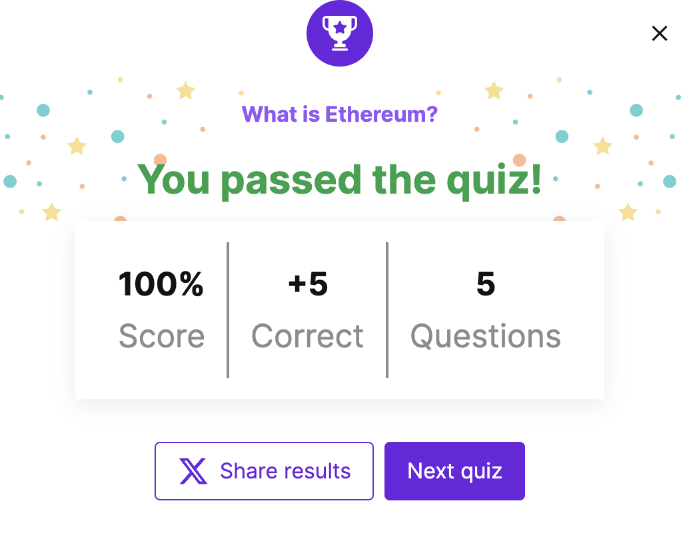

> 请在上边的 timezone 添加你的当地时区(UTC)，这会有助于你的打卡状态的自动化更新，如果没有添加，默认为北京时间 UTC+8 时区


# 你的名字

1. 自我介绍

**Dex** 对这个世界保持好奇心->想深入了解以太坊

2. 你认为你会完成本次残酷学习吗？

会的

3. 你的联系方式（推荐 Telegram）

- **Telegram**：[t.me/dexhunt3r](https://t.me/dexhunt3r)  
- **Twitter/X**：[x.com/dexhunt3r](https://x.com/dexhunt3r)  
- **farcaster**: [warpcaster.com/dexhunter.eth](https://warpcast.com/dexhunter.eth)

## Notes

<!-- Content_START -->

### 2025.03.10

先把所有资源看了一下，比如

* [油管频道eth protocol fellows](https://www.youtube.com/@ethprotocolfellows/videos)
* [wiki efp.wiki](https://epf.wiki/#/eps/intro)
* [discord](https://discord.com/invite/epfsg)
* [github repo protocol studies](https://github.com/eth-protocol-fellows/protocol-studies)
* [ethereum quizzes](https://ethereum.org/en/quizzes/) 


今天好像已经是week4了，所以需要把之前的内容过一下
* [week1](https://epf.wiki/#/eps/week1)
    * 大概介绍了下protocol, 历史和哲学
    * 以太坊协议设计
        * [技术黄皮书](https://ethereum.github.io/yellowpaper/paper.pdf)
        * 实现
        * 测试
        * 合作
* [week2](https://epf.wiki/#/eps/week2)
    * week1的链接其实直接先到week3的，不确定为啥，week3对应的是lecture2 consensus，具体看[这里](https://github.com/eth-protocol-fellows/protocol-studies/blob/main/docs/eps/week3.md)
    * 执行层
        * 区块
        * 状态机
        * jrpc信息传递
* [week3](https://epf.wiki/#/eps/week3)
    * 共识层就是PoS，具体看Casper的[论文](https://arxiv.org/pdf/2003.03052)


- *做了一下quizzes，感觉主要是夸夸以太坊*


### 2025.03.11

今天看了[week4](https://epf.wiki/#/eps/week4)的内容，主要是关于测试和安全
* 第一次知道retesteth还有个webui [这里](http://retesteth.ethdevops.io/web/)，可以测试各种不同的方法，教程在[这里](https://ethereum-tests.readthedocs.io/en/latest/retesteth-tutorial.html)，还蛮有意思的

```
Running tests using path: /data/tests
Running 1 test case...
Retesteth config path: /var/www/.retesteth
WARNING: Retesteth configs version is different (running: '0.3.2-legacy' vs config '0.3.2-cancun')!
WARNING: Update configs to the latest by deleting the folder `/var/www/.retesteth`!
Active client configurations: 't8ntool '
Checking test filler hashes for GeneralStateTests/stExample
Filter: 'accessListExample Shanghai'
Check `/data/tests/GeneralStateTests/stExample/accessListExample.json` hash
SrcFile `/data/tests/src/GeneralStateTestsFiller/stExample/accessListExampleFiller.yml`
Read json structure accessListExampleFiller.yml
Read json structure finish
Running tests for config 'Ethereum GO on StateTool' 2
Test Case "stExample": (1 of 1)
100%
Instantiated: "evm version 1.15.6-unstable-4cdd7c86-20250310"
Running accessListExample: (6995263567478450108)
Read json structure accessListExample.json
Read json finish
WARNING: Specified filter did not run a single transaction!  (GeneralStateTests/stExample/accessListExample, fork: Shanghai, TrInfo: d: -1, g: -1, v: -1)

*** No errors detected
*** Total Tests Run: 1


--------
*** TOTAL WARNINGS DETECTED: 3 warnings during all test execution!
--------
info: Retesteth configs version is different (running: '0.3.2-legacy' vs config '0.3.2-cancun')!
info: Update configs to the latest by deleting the folder `/var/www/.retesteth`!
info: Specified filter did not run a single transaction!  (GeneralStateTests/stExample/accessListExample, fork: Shanghai, TrInfo: d: -1, g: -1, v: -1) (GeneralStateTests/stExample/accessListExample, fork: Shanghai, TrInfo: d: -1, g: -1, v: -1)
```

### 2025.03.12

不知道为什么昨天的commit被overwritten了，然后根据读历史的启发今天开始带着问题来学习。
-> 今天想知道的问题是，为什么以太坊主链到2025年了还是这么贵和慢 why is ehtereum mainnet still costly and slow in 2025?


slowness:
> blocks produced every 12 seconds and each block containing about 185 transactions on average.

costliness:
> The costliness arises from gas fees, which users pay for computational resources. During high demand, these fees spike due to limited block space, and the market-driven gas price mechanism means users must bid higher to get transactions processed quickly. Even with changes like the London hard fork in 2021 introducing a base fee, network congestion still drives up costs.

根据 [EIP-1559](https://github.com/ethereum/EIPs/blob/master/EIPS/eip-1559.md)
```
Transaction/Gas fee = Gas used × (Base fee + Priority fee)
```

可能是要等pectra和sharding才能让主链交易变得更快或便宜

References:
1. [chatgpt deepresearch reference](https://chatgpt.com/share/67d0ced5-5e74-800d-89a3-7bd7fc4f8006)
2. [grok research](https://grok.com/share/bGVnYWN5_1aab2e22-5f73-48db-bf1f-718eed7559c6)


### 2025.03.13

继续啃PoS

* [eth pos](https://ethereum.org/en/developers/docs/consensus-mechanisms/pos/)
* [vitalik's post](https://vitalik.eth.limo/general/2017/12/31/pos_faq.html)
* [Casper FFG](https://arxiv.org/pdf/1710.09437)

--> 发现一个简单的python实现 [simple casper](https://github.com/omoindrot/simple_casper/tree/master)

不过好像没有测试finality和一些攻击的场景，感觉可以改写试试

原本的casper代码 [https://github.com/ethereum/casper](https://github.com/ethereum/casper)
新的代码  [https://github.com/ethereum/consensus-specs](https://github.com/ethereum/consensus-specs)

validator的条件
* 32 ETH

消减条约 slashing rules
* A validator must not publish two distinct votes for the same target height
* A validator must not vote within the span of its other votes.

### 2025.03.14

参考两本书
* [Understanding-Ethereum-Go-Version](https://github.com/ABCDELabs/Understanding-Ethereum-Go-version)
* [mastering ethereum](https://github.com/ethereumbook/ethereumbook)

以及开始看以太坊源码
* [reth](https://github.com/paradigmxyz/reth)
* [go-eth](https://github.com/ethereum/go-ethereum)

### 2025.03.15

关注一下mev
* 看到了siyuan大佬的[post](https://x.com/yzilabs/status/1899813012233752989)
* [mev book](https://www.monoceros.com/insights/maximal-extractable-value-book)
* [mev book on github](https://github.com/0xOsiris/Mev_Book)
* also take a look at flash bot's mev letters

了解了一些holesky的事情背景
[grok summary](https://grok.com/share/bGVnYWN5_a8cfe9ef-e843-4539-8aee-cfaf4cc181e9)


### 2025.03.16

看了这个黄皮书简化版的解释[1]和精通以太坊第一章[2]

总结下
以太坊合约是一个有确定性但实际上无限的状态机（unbounded state machine），主要有两个功能
1. 全局可访问的状态 singleton state (distributed single-state)
2. 可以改变这个状态的虚拟机

World State 世界状态是 地址 到 账户 的映射，这部分的信息用 Merkle Patricia Trees 存储在数据库后端

我觉得这篇关于以太坊的技术实现文章写的非常通俗易懂，如果有不懂的内容可以参考

[1]: https://github.com/chronaeon/beigepaper/blob/master/beigepaper.pdf
[2]: https://github.com/ethereumbook/ethereumbook/blob/develop/01what-is.asciidoc

### 2025.03.17

看精通以太坊第二章[1]

1 wei = 1e-18 ether
or 1 ether = 1e18 wei

wallet (personal opinion)
* ~~metamask~~ -> DO NOT USE (as for March 2025) unless you are lazy
-> rabby wallet (the safe one)

don't lose your priv key
-> use a cold wallet if possible

#### Networks

* main net
* test net
    * ropsten
    * kovan
    * rinkeby
* localhost/custom rpc

TODO: will read more tomorrow about smart contract and world computer concept


[1]: https://github.com/ethereumbook/ethereumbook/blob/develop/02intro.asciidoc

### 2025.03.18

精通以太坊第三章[1]

几个客户端的实现
1. Parity, written in Rust4
2. Geth, written in Go
3. cpp-ethereum, written in C++
4. pyethereum, written in Python
5. Mantis, written in Scala
6. Harmony, written in Java

[1]: https://github.com/ethereumbook/ethereumbook/blob/develop/03clients.asciidoc

### 2025.03.19

第四章，关于密码学，内容比较多，分几天来看完[1]

椭圆曲线密码学[2]


* OpenSSL
* Bitcoin's libsecp256k1 -> secp256k1 elliptic curve 
* Hash Function


[1]: https://github.com/ethereumbook/ethereumbook/blob/develop/04keys-addresses.asciidoc
[2]: https://github.com/ethereumbook/ethereumbook/blob/develop/04keys-addresses.asciidoc#elliptic_curve


### 2025.03.22

* two types of accounts
    * externally owned accounts (EOAs) <- private key + address + signature
    * contracts <- smart contract code (executed by EVM)

#### Based on [chapter 5](https://github.com/ethereumbook/ethereumbook/blob/develop/05wallets.asciidoc)

Ethereum wallets serve as the primary user interface to Ethereum, with two main aspects:
- **For users**: Applications that manage keys, track balances, and create/sign transactions
- **For developers**: Systems for key management and storage

Despite the name, wallets don't actually contain ether or tokens – these assets exist on the blockchain. Wallets hold the keys that provide control over these assets.

Wallet Technology Types:

##### 1. Nondeterministic (Random) Wallets
- Each key is independently generated from a different random number
- Also known as "Just a Bunch of Keys" (JBOK) wallets
- More difficult to back up and manage
- Example: Keystore files (JSON-encoded, encrypted by passphrase)

##### 2. Deterministic (Seeded) Wallets
- All keys derived from a single master key (seed)
- A single backup at creation secures all funds
- Seed can be encoded as mnemonic code words for easier backup

##### 3. Hierarchical Deterministic (HD) Wallets
- Based on BIP-32 standard
- Keys derived in a tree structure (parent keys → child keys → grandchild keys)
- Provides organizational structure and improved security


Modern wallets typically implement several industry standards:

##### BIP-39: Mnemonic Code Words
- Creates a human-readable backup (12-24 words)
- Random entropy → checksum → encode as words → derive seed
- Optional passphrase adds security (but increases risk of fund loss if forgotten)

##### BIP-32: Hierarchical Deterministic Wallets
- Creates tree-like structure of keys
- Extended keys (xprv, xpub) can derive child keys
- Hardened derivation prevents chain code compromise

##### BIP-43/44: Standardized HD Wallet Structure
- Defines purpose and path for HD wallets
- Standard path: m/purpose'/coin_type'/account'/change/address_index
- For Ethereum: m/44'/60'/0'/0/x (where x is the address index)

#### Key Concepts

- **Extended Keys**: Parent keys that can derive child keys (with chain code)
- **Hardened Derivation**: Breaks parent-child relationship to improve security
- **HD Wallet Path**: Naming convention for identifying keys in the tree (e.g., m/44'/60'/0'/0/2)
- **Mnemonic Words vs. Brainwallets**: Mnemonics are generated randomly by the wallet, not chosen by the user

#### Best Practices

For implementing Ethereum wallets, build an HD wallet with a seed encoded as mnemonic code, following BIP-32, BIP-39, BIP-43, and BIP-44 standards for maximum security, flexibility, and compatibility.

#### Security Considerations

- Always back up your seed phrase (mnemonic words) in a secure, physical location
- Never store your seed phrase digitally
- Consider using hardware wallets for large amounts of funds
- If using a passphrase with your mnemonic, ensure it can be recovered by trusted parties if needed

### 2025.03.23

Transactions are signed messages originated by externally owned accounts (EOAs), transmitted through the Ethereum network, and recorded on the blockchain. They are the only mechanism that can:
- Trigger state changes in Ethereum
- Cause smart contracts to execute

A transaction contains the following data:

- **Nonce**: A sequence number issued by the originator to prevent message replay
- **Gas price**: Amount of ether (in wei) the originator is willing to pay per unit of gas
- **Gas limit**: Maximum amount of gas the originator is willing to buy
- **Recipient**: Destination Ethereum address
- **Value**: Amount of ether (in wei) to send
- **Data**: Variable-length binary data payload
- **v, r, s**: Components of the ECDSA digital signature

*All transactions are serialized using Recursive Length Prefix (RLP) encoding.*

The nonce is critical for two reasons:
1. **Transaction ordering**: Ensures transactions from the same account are processed in the order they were created
2. **Replay protection**: Makes each transaction unique, preventing duplicated payments

*Nonces are tracked sequentially for each account. The nonce for a new transaction must be exactly one higher than the previous transaction's nonce.*

Tracking Nonces:
- Use `web3.eth.getTransactionCount(address)` to find the current nonce
- For multiple rapid transactions, maintain your own nonce counter
- Parity offers `parity_nextNonce` for more reliable nonce tracking

Nonce Gaps and Concurrency Issues:
- Missing nonces will cause subsequent transactions to be held in the mempool
- Duplicate nonces will cause one transaction to be accepted and one rejected
- Concurrency can cause problems when multiple systems generate transactions from the same account

Gas is Ethereum's mechanism for:
- Measuring computational resource usage
- Preventing DoS attacks
- Allocating resources in a fair manner

Two important components:
- **Gas price**: How much ether per unit of gas (set by the transaction creator)
- **Gas limit**: Maximum gas units the transaction can consume

*Simple ether transfers between EOAs always cost exactly 21,000 gas. Contract interactions vary in cost depending on complexity.*

The recipient is specified in the `to` field:
- Can be an EOA or contract address
- No validation is performed on this field
- Sending to an invalid address effectively "burns" the ether

Transactions can contain:
- **Value only**: A payment
- **Data only**: A contract invocation
- **Both**: A payment and contract invocation
- **Neither**: Technically valid but not useful

For contract interactions, the data field typically contains:
- Function selector: First 4 bytes of the Keccak-256 hash of the function signature
- Function arguments: Encoded according to ABI specification

Special Transaction: Contract Creation

Contracts are created by sending transactions to the special "zero address" (0x0):
- The `to` field is set to 0x0
- The contract bytecode is included in the data field
- Optional ether can be included in the `value` field to fund the new contract

Digital Signatures

Transactions are signed using the Elliptic Curve Digital Signature Algorithm (ECDSA). Signatures serve three purposes:

1. **Authorization**: Proves the owner of the private key authorized the transaction
2. **Non-repudiation**: The proof of authorization is undeniable
3. **Integrity**: The transaction data cannot be modified after signing

The signature includes three values:
- **r, s**: The ECDSA signature components
- **v**: Recovery identifier that helps derive the public key from the signature

ECDSA Mathematics

The ECDSA signature creation process:
1. Generate an ephemeral (temporary) private key
2. Derive the corresponding ephemeral public key
3. The r value is the x coordinate of the ephemeral public key
4. The s value is calculated using the private key, transaction hash, and ephemeral key

note: *Signature verification can recover the public key without knowing the private key.*

Transaction Signing in Practice

To sign a transaction:
1. Create a transaction data structure with all fields
2. RLP-encode the transaction data
3. Calculate the Keccak-256 hash of the serialized message
4. Sign the hash with the private key using ECDSA
5. Append the signature values to the transaction

Offline Signing

For security, transaction signing can be separated from transaction transmission:
1. Create unsigned transaction on an online system
2. Transfer to an offline system for signing
3. Transfer the signed transaction back to an online system for broadcasting

note: *This process, called "offline signing," helps protect private keys by keeping them off internet-connected computers.*

Transaction Propagation

Transactions propagate through the Ethereum network via a flood routing protocol:
1. The node with the signed transaction validates it
2. It then transmits the transaction to all its neighbors
3. Each neighbor validates and retransmits to their neighbors
4. Within seconds, the transaction reaches all nodes in the network

Recording on the Blockchain

Valid transactions are eventually:
1. Selected by miners for inclusion in a block
2. Recorded permanently on the blockchain
3. Execute their effect on the Ethereum state

Multiple-Signature (Multisig) Transactions

While Ethereum's basic transactions don't directly support multiple signatures, smart contracts can implement multisig functionality:
- Funds are sent to a contract that enforces signature requirements
- Multisig contracts can have arbitrary signing conditions
- The contract only releases funds when conditions are satisfied

EIP-155: Transaction Replay Protection

EIP-155 prevents transaction replay attacks between different Ethereum networks by:
- Including a chain identifier in the transaction data
- Modifying the signing algorithm to encode the chain ID in the v value
- Making it impossible to replay a transaction meant for one network on another

### 2025.03.24

Based on [Chapter 7](https://github.com/ethereumbook/ethereumbook/blob/develop/07smart-contracts-solidity.asciidoc)

What Is a Smart Contract?

Smart contracts in Ethereum are immutable computer programs that run deterministically in the Ethereum Virtual Machine. Despite the name, they aren't "smart" in the AI sense, nor are they legal contracts. They're simply programs deployed on the blockchain that execute exactly as programmed without possibility of downtime, censorship, or third-party interference.

Life Cycle of a Smart Contract

Smart contracts are written in high-level languages (most commonly Solidity), compiled to EVM bytecode, and deployed through special creation transactions. Each contract has a unique Ethereum address but no associated private key. Contracts only execute when called by a transaction, either directly from an EOA or indirectly via another contract. They remain dormant until triggered, and execution is atomic—either fully successful or completely reverted.

Ethereum High-Level Languages

While EVM bytecode is the ultimate language of execution, developers typically write smart contracts in higher-level languages. Solidity is the most widely used, but others include LLL, Serpent, Vyper, and Bamboo. These languages vary in their approach, with some being more declarative (functional) and others more imperative (procedural).

Building Smart Contracts with Solidity

Solidity is an object-oriented language with syntax similar to JavaScript or C++. It includes features specific to blockchain development, such as address types, gas optimization patterns, and built-in functions for Ethereum operations. The chapter walked through building a simple "Faucet" contract that can receive and dispense ether.

The Ethereum Contract ABI

The Application Binary Interface (ABI) defines how to encode function calls and data for the EVM. It allows applications to interact with contracts by specifying the format of functions, arguments, and return values. The ABI is typically output as a JSON structure during compilation.

## Solidity Programming Features

The chapter covered many Solidity programming features:

- **Data types**: Booleans, integers, addresses, arrays, mappings, structs, etc.
- **Variables and functions**: Global variables like `msg.sender`, `block.number`, and built-in functions
- **Contract definition**: How to define contracts, interfaces, and libraries
- **Function modifiers**: For adding preconditions to functions
- **Inheritance**: How contracts can inherit from other contracts
- **Error handling**: Using assert, require, and revert
- **Events**: For logging information and providing return values to the front end
- **Contract interaction**: How to call other contracts using various methods

Gas Considerations

Gas is a critical constraint in smart contract development. The chapter discussed strategies for minimizing gas consumption, such as avoiding dynamically sized arrays and unnecessary external calls. It also showed how to estimate the gas cost of contract functions.

Smart contract development with Solidity requires understanding not just the language, but also the execution environment, security considerations, and economic implications of your code. This chapter provided the foundation for building effective and efficient smart contracts on Ethereum.

### 2025.03.25

Based on[chapter 8](https://github.com/ethereumbook/ethereumbook/blob/develop/08smart-contracts-vyper.asciidoc)

Vyper is an experimental, contract-oriented programming language for the Ethereum Virtual Machine (EVM)
It emphasizes readability and security. 
It aims to make it easier for developers to write intelligible and secure code, 
reducing the likelihood of vulnerabilities in smart contracts.

Vulnerabilities in Smart Contracts

A study of nearly one million Ethereum smart contracts identified three categories of vulnerabilities:

- **Suicidal Contracts**: Can be killed by arbitrary addresses
- **Greedy Contracts**: Can reach a state where they cannot release Ether
- **Prodigal Contracts**: Can be made to release Ether to arbitrary addresses

Vyper addresses these issues by enforcing a design that discourages writing misleading or insecure code.

* Key Differences from Solidity:
1. No Modifiers
2. No Class Inheritance
3. No Inline Assembly
4. No Function Overloading
5. Strict Variable Typecasting
6. No Infinite Loops
7. Explicit Preconditions and Postconditions


* Decorators

```python
@public     # Function is accessible externally
@private    # Function can only be called within the contract
@constant   # Function does not modify state
@payable    # Function can receive Ether
```

Variables and functions must be declared before use:

```python
# Variable declaration
counter: int128

@public
def increment():
    self.counter += 1
```

* Built-in Overflow Protection

- Implements `SafeMath`-like checks automatically
- Uses clamps to enforce value ranges
- Prevents execution of overflowing operations

* Data Operations

**Global State**:
- State variables stored in Ethereum's global state trie
- Contracts can only modify their own storage

**Events (Logs)**:
```python
# Declaration
Transfer: event({from: indexed(address), to: indexed(address), value: uint256})

# Emitting
log Transfer(msg.sender, to_address, amount)
```

* Compilation Tools

- **Online Tools**: 
  - [Vyper Online Compiler](https://vyper.online)
  - [Etherscan Vyper Compiler](https://etherscan.io/vyper)
  - [Remix with Vyper plugin](https://remix.ethereum.org)

- **Command Line**:
  ```bash
  vyper /path/to/contract.vy       # Compile to bytecode
  vyper -f json /path/to/contract.vy  # Generate ABI in JSON format
  ```

### 2025.03.26

Based on[chapter 9](https://github.com/ethereumbook/ethereumbook/blob/develop/09smart-contracts-security.asciidoc)

#### Common Vulnerabilities

1. Reentrancy Attacks

Exploiting the ability to repeatedly call a function before previous executions are completed, 
leading to inconsistent states and potential fund siphoning.

```solidity
// Vulnerable code example
function withdraw() public {
    uint amount = balances[msg.sender];
    // Send funds before updating state
    (bool success, ) = msg.sender.call{value: amount}("");
    // State update happens after external call
    balances[msg.sender] = 0;
}
```

2. Integer Overflows and Underflows

Errors occurring when calculations exceed the maximum or minimum capacity of a data type, causing unexpected behavior.

```solidity
// Vulnerable code example
function transfer(address _to, uint256 _value) public {
    // No check if balance >= _value
    balances[msg.sender] -= _value;
    balances[_to] += _value;
}
```

3. Denial of Service (DoS)

Malicious actions that prevent contract functions from executing properly, 
often by consuming excessive gas or manipulating contract state.

4. Access Control Issues

Incorrect implementation of authorization checks, allowing unauthorized entities to perform privileged actions.

5. Timestamp Dependence

Relying on block timestamps for critical contract logic, which can be manipulated by miners within a certain range.

6. Unhandled Exceptions

Failing to manage errors or exceptions, which can disrupt contract execution flow and security.

#### Best Practices for Secure Smart Contracts

- **Code Review and Auditing**: Regularly auditing code to detect and fix vulnerabilities before deployment.
- **Use Established Libraries**: Leveraging well-tested and community-reviewed libraries and frameworks (e.g., OpenZeppelin contracts).
- **Thorough Testing**: Implementing comprehensive test suites, including unit tests, integration tests, and property-based tests.
- **Avoiding Complex Logic**: Keeping contracts simple and modular to reduce the attack surface and make auditing easier.
- **Fail-Safe Mechanisms**: Designing contracts to be secure by default, with appropriate fallback functions and error handling.

#### Security Tools and Resources

- **Static Analysis Tools**: Utilizing tools like **Mythril**, **Slither**, and **Oyente** to automatically detect vulnerabilities.
- **Formal Verification**: Applying mathematical methods to prove the correctness of contract algorithms against a formal specification.
- **Bug Bounty Programs**: Encouraging external security researchers to find and report vulnerabilities through incentivized programs.

#### Notable Security Incidents

- **The DAO Attack (2016)**: An infamous reentrancy attack that led to the theft of around 3.6 million Ether, highlighting the importance of secure coding practices.
- **Parity Wallet Bugs (2017)**: A series of vulnerabilities in a popular wallet that resulted in significant funds being inaccessible or stolen.

#### Legal and Ethical Considerations

- **Compliance**: Understanding and adhering to legal regulations regarding smart contracts and digital transactions in applicable jurisdictions.
- **Transparency and Disclosure**: Maintaining openness about contract functionality and potential risks to users and stakeholders.

#### Future Trends in Smart Contract Security

- **Advanced Security Protocols**: Development of new protocols and standards aimed at enhancing security.
- **Layer 2 Solutions**: Implementing off-chain solutions to reduce the burden on the main blockchain and improve security.
- **Education and Community Efforts**: Growing emphasis on educating developers and fostering a community dedicated to best practices in security.

#### READ MORE

1. OpenZeppelin Security Blog: https://blog.openzeppelin.com/
2. Ethereum Smart Contract Best Practices: https://consensys.github.io/smart-contract-best-practices/
3. Trail of Bits Security Blog: https://blog.trailofbits.com/

### 2025.03.27

#### Token Use Cases

##### Financial Uses
- **Currency**: Function as a private form of money
- **Asset**: Represent ownership of tangible/intangible assets
- **Equity**: Represent shares in organizations

##### Rights and Access
- **Resource**: Represent shared computing/storage resources
- **Access**: Grant rights to digital/physical properties
- **Voting**: Enable voting rights in organizations

##### Identity and Verification
- **Identity**: Represent digital or legal identity
- **Attestation**: Verify certifications or facts
- **Collectibles**: Represent unique digital or physical items
- **Utility**: Access to specific services

#### Key Characteristics

##### Fungibility
- **Fungible Tokens**: Interchangeable units (like currency)
- **Non-fungible Tokens**: Unique items (like deeds or collectibles)

##### Intrinsicality
- **Intrinsic**: Assets native to the blockchain
- **Extrinsic**: External assets represented on blockchain

##### Risk Factors
- Counterparty risk for external asset-backed tokens
- Implementation security considerations
- Gas costs in ether for token transactions

#### Token Standards

##### Major Standards
1. **ERC20**
   - Most common standard
   - Used for fungible tokens
   - Basic transfer and approval functions

2. **ERC223**
   - Proposed improvement
   - Prevents accidental token loss
   - Enhanced safety features

3. **ERC777**
   - Advanced token standard
   - Additional features and hooks
   - Backward compatible with ERC20

4. **ERC721**
   - Standard for non-fungible tokens
   - Unique asset representation
   - Used for deeds and collectibles

#### Implementation Guidelines

##### Best Practices
- Use established standards for interoperability
- Leverage battle-tested implementations
- Consider security implications of extensions

##### Common Extensions
- Burning

### 2025.03.28


#### Oracle Use Cases and Examples

Oracles can provide various types of data, including:

- **Random Numbers**: For fair selection in games and lotteries.
- **Financial Data**: Exchange rates, stock prices, benchmark interest rates.
- **Weather Data**: For insurance contracts and predictions.
- **Sporting Events**: For prediction markets.
- **IoT Data**: For supply chain tracking.

#### Oracle Design Patterns

There are three main oracle design patterns:

1. **Immediate-Read Oracles**
Provide data needed for immediate decisions. 
Data is stored in the oracle's smart contract storage and can be accessed directly by other contracts.

2. **Publish-Subscribe Oracles**
Oracles update data regularly, 
and interested parties can subscribe to receive updates or monitor changes.

3. **Request-Response Oracles**
DApps request specific data, and the oracle retrieves and returns the data asynchronously.

#### Data Authentication

Ensuring the integrity and authenticity of the data provided by oracles is crucial. Two common approaches are:

- **Authenticity Proofs**: 
Cryptographic guarantees that data has not been tampered with, such as TLSNotary proofs.

- **Trusted Execution Environments (TEEs)**: 
Hardware-based secure enclaves (e.g., Intel SGX) that securely process and attest to data integrity.

#### Computation Oracles

Computation oracles perform off-chain computations and return results to smart contracts. 
This is useful for resource-intensive calculations that are impractical to perform on-chain due to gas limits.

Examples include:

- **Oraclize**
Offers computation services using AWS virtual machines and Docker containers.
- **TrueBit**
Provides scalable and verifiable off-chain computations via a network of incentivized solvers and verifiers.

#### Decentralized Oracles

Decentralized oracles aim to eliminate single points of 
failure by using networks of data providers and on-chain aggregation methods. 

Examples include:
- **ChainLink**
Uses reputation, order-matching, and aggregation contracts to source data from multiple oracles.
- **SchellingCoin Protocol**
Relies on multiple participants reporting values and using the median as the correct answer,
incentivizing honest reporting.

#### Oracle Client Interfaces in Solidity

Smart contracts in Solidity can interact with oracles through defined interfaces. 

Examples include:

##### Using Oraclize to Update ETH/USD Exchange Rate

An example contract that uses Oraclize to fetch and update the ETH/USD price from an external API every 10 minutes.

```solidity
contract EthUsdPriceTicker is usingOraclize {

    uint public ethUsd;

    event newOraclizeQuery(string description);
    event newCallbackResult(string result);

    function EthUsdPriceTicker() payable {
        oraclize_setProof(proofType_TLSNotary | proofStorage_IPFS);
        queryTicker();
    }

    function __callback(bytes32 _queryId, string _result, bytes _proof) public {
        if (msg.sender != oraclize_cbAddress()) throw;
        newCallbackResult(_result);
        ethUsd = parseInt(_result, 2);
        queryTicker();
    }

    function queryTicker() external payable {
        if (oraclize_getPrice("URL") > this.balance) {
            newOraclizeQuery("Oraclize query was NOT sent, please add some ETH to cover for the query fee");
        } else {
            newOraclizeQuery("Oraclize query was sent, standing by for the answer...");
            oraclize_query(60 * 10, "URL", "json(https://min-api.cryptocompare.com/data/price?fsym=ETH&tsyms=USD).USD");
        }
    }
}
```

##### Contract Calling the BlockOne IQ Service for Market Data

An example of a contract interacting with Thomson Reuters' BlockOne IQ oracle service to request market data.

```solidity
contract OracleB1IQClient {

    Oracle private oracle;
    event LogError(bytes32 description);

    function OracleB1IQClient(address addr) external payable {
        oracle = Oracle(addr);
        getIntraday("IBM", now);
    }

    function getIntraday(bytes32 ric, uint256 timestamp) public {
        uint256 id = oracle.initRequest(0, this.handleSuccess, this.handleFailure);
        oracle.addArgumentToRequestString(id, "symbol", ric);
        oracle.addArgumentToRequestUint(id, "timestamp", timestamp);
        oracle.executeRequest(id);
    }

    function handleSuccess(uint256 id) public {
        assert(msg.sender == address(oracle));
        bytes32 ric = oracle.getResponseString(id, "symbol");
        uint256 open = oracle.getResponseUint(id, "open");
        uint256 high = oracle.getResponseUint(id, "high");
        uint256 low = oracle.getResponseUint(id, "low");
        uint256 close = oracle.getResponseUint(id, "close");
        uint256 bid = oracle.getResponseUint(id, "bid");
        uint256 ask = oracle.getResponseUint(id, "ask");
        uint256 timestamp = oracle.getResponseUint(id, "timestamp");
        oracle.deleteResponse(id);
        // Do something with the price data
    }

    function handleFailure(uint256 id) public {
        assert(msg.sender == address(oracle));
        bytes32 error = oracle.getResponseError(id);
        oracle.deleteResponse(id);
        emit LogError(error);
    }
}
```


### 2025.03.29


A DApp is an application that operates without central control, 
leveraging decentralized technologies to eliminate single points of failure or authority. 

The key aspects that can be decentralized in an application include:
- **Backend Software (Smart Contracts)**: Logic and state managed on blockchain.
- **Frontend Software**: Interfaces running locally or served via decentralized storage.
- **Data Storage**: Utilizing decentralized filesystems like IPFS or Swarm.
- **Message Communications**: Employing protocols like Whisper for P2P messaging.
- **Name Resolution**: Using systems like the Ethereum Name Service (ENS).

#### Advantages of DApps

- **Resiliency**: No downtime due to decentralized operation.
- **Transparency**: Open-source code and on-chain transactions enhance trust.
- **Censorship Resistance**: Users interact directly without centralized interference.


#### Backend (Smart Contracts)

Smart contracts on Ethereum act as the backend, 
executing business logic and maintaining state. 
These contracts are immutable and operate transparently on the blockchain.
Key considerations when developing smart contracts include:

- **Immutability**: Contracts cannot be altered once deployed.
- **Gas Costs**: Computational operations incur costs, so efficiency is essential.

#### Frontend (Web User Interface)

The frontend can be built using standard web technologies (HTML, CSS, JavaScript) 
and interacts with the blockchain via libraries like **web3.js**. 
Users can access DApps through web browsers equipped with extensions like **MetaMask**.

#### Data Storage

Due to the high cost of on-chain storage, DApps use decentralized storage solutions for large data:

- **IPFS (InterPlanetary File System)**: A P2P hypermedia protocol for storing and sharing content-addressed files.
- **Swarm**: An Ethereum-native decentralized storage and content distribution service.

#### Decentralized Message Communications Protocols

Protocols like **Whisper** enable P2P messaging without centralized servers, 
allowing for features like encrypted chat rooms within DApps.

#### Name Resolution

The **Ethereum Name Service (ENS)** provides a decentralized domain name system, 
allowing human-readable names (e.g., `mydapp.eth`) to reference smart contracts, wallets, or Swarm/IPFS content hashes.


### 2025.03.30

<!-- Content_END -->
